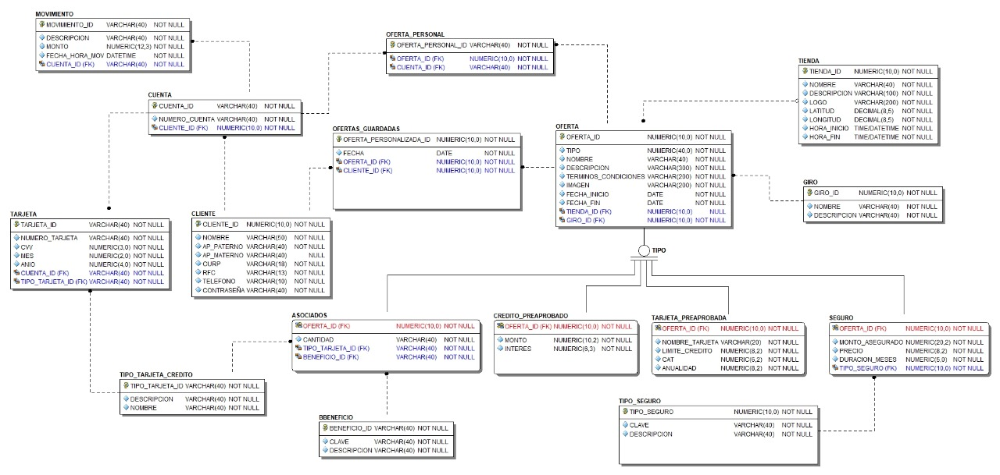

# Geofertas 💸

### Explicación
La aplicación se podrá usar sin necesidad de estar registrado para ver las ofertas locales de las empresas que tengan convenio con BBVA. Además se podrá iniciar sesión con la actual cuenta de las aplicaciones de BBVA, donde pide solamente el teléfono y la contraseña. Los clientes tienen nombre, apellido paterno, apellido materno, curp, teléfono y contraseña. Un cliente puede tener varias cuentas y estas constan del número de cuenta, monto total y movimientos. Los movimientos constan de: nombre del movimiento, monto y fecha de realización.

- Ofertas generales
	- Nombre de la oferta
	- Descripción
	- Términos y condiciones
	- Vigencia
	- Imagen
	- Tienda que lo ofrece

Para las empresas aliadas que quieran mostrar sus ofertas en la aplicación necesitaremos el nombre la tienda, ubicación, logo, horario de atención.

Credito preaprobado: nombre, descripcion, monto, vigencia, interes, terminos y condiciones (zelda), logo.
Seguros: nombre del seguro, tipo, descripción, monto asegurado, costo, vigencia promoción, terminos y condiciones, duracion
Tarjetas pre aprobadas: nombre (Azul, UNAM, POLI, ...), limite credito, interes anual, anualidad.
Ofertas alianza: nombre, descripcion,  

nombre, descripcion, monto, vigencia oferta,  

Las ofertas son personalizadas para los usuarios clientes que se dieron de alta en la aplicación, mientras que a los usuarios no clientes se los mostrará ofertas estándares, en el caso de los servicios de BBVA nos limitamos a ofrecer seguros y tarjetas de crédito mediante las promociones con los aliados (Si fueras cliente tendrías una Pantalla con 50% si pagas con tus puntos bancomer). 
  

### Modelo de datos
