# BBVA Geofertas - DevHat 🎩

### Planteamiento 🔍

Se planea contruir una aplicación móvil, disponible para ambos sistemas operativos, capaz de utilizar la ubicación de los usuarios y mediante el consumo de la API de Google Maps, identificar la cercanía de un usuario de la aplicación, sea o no cliente de BBVA, con los puntos geográficos registrados en nuestra base de datos de empresas aliadas a BBVA y enviarle notificaciones personalizadas en tiempos adecuados. Estas aplicaciones ofrecerán ofertas de productos de nuestros aliados y de de soluciones que ofrece BBVA, sean créditos, seguros, hipotecas u otros servicios.

## Modelo de negocio 📊

La aplicación se podrá usar sin necesidad de estar registrado para ver las ofertas locales de las empresas que tengan convenio con BBVA. Además se podrá iniciar sesión con la actual cuenta de las aplicaciones de BBVA, donde pide solamente el teléfono y la contraseña. Los clientes tienen nombre, apellido paterno, apellido materno, curp, teléfono y contraseña. Un cliente puede tener varias cuentas y estas constan del número de cuenta, monto total y movimientos. Los movimientos constan de: nombre del movimiento, monto y fecha de realización.

- Ofertas generales
	- Nombre de la oferta
	- Tipo (Alianza, Crédito preaprobado, Seguros, Hipoteca, Tarjetas preaprobadas).
	- Descripción
	- Monto
	- Términos y condiciones
	- Vigencia
	- Imagen
	- Tienda que lo ofrece (BBVA)

Para las empresas aliadas que quieran mostrar sus ofertas en la aplicación necesitaremos el nombre la tienda, ubicación, logo, horario de atención.

Las ofertas son personalizadas para los usuarios clientes que se dieron de alta en la aplicación, mientras que a los usuarios no clientes se los mostrará ofertas estándares, en el caso de los servicios de BBVA nos limitamos a ofrecer seguros y tarjetas de crédito mediante las promociones con los aliados (Si fueras cliente tendrías una Pantalla con 50% si pagas con tus puntos bancomer). 

### Modelo relacional de BD

## Arquitectura AWS 🏛

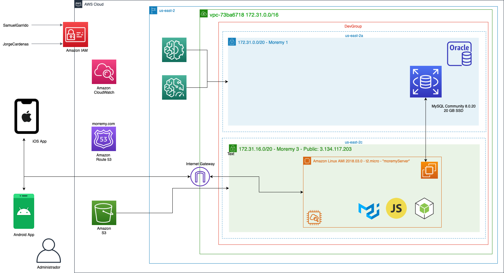

### Prototipado

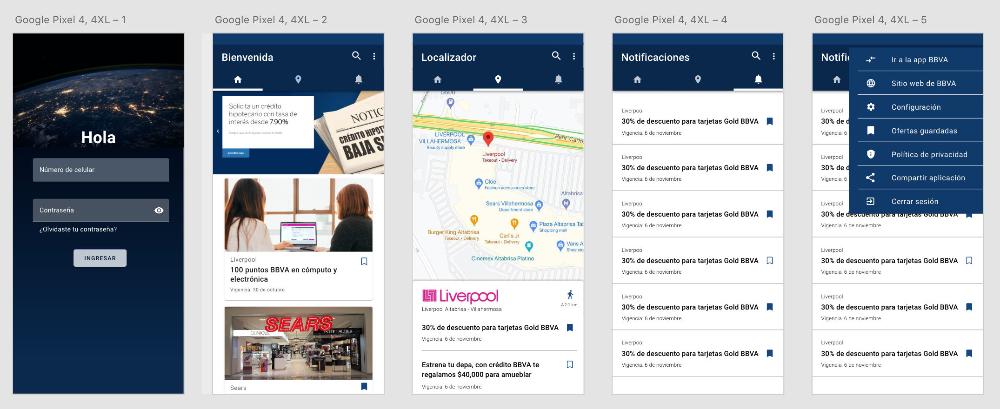

## Capturas funcionales

### iOS

  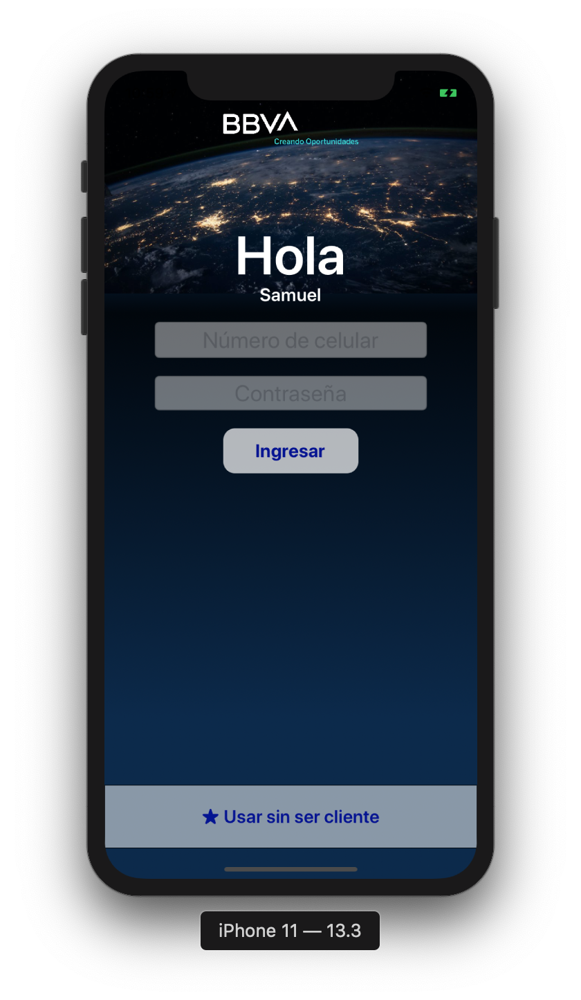
  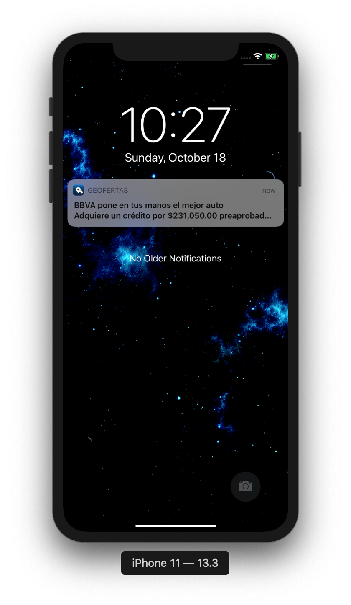
  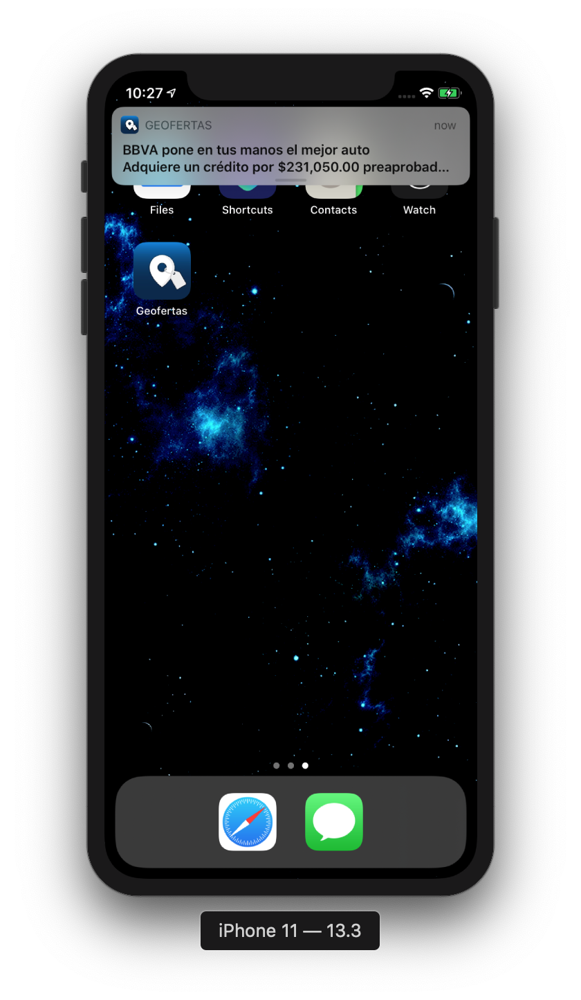
  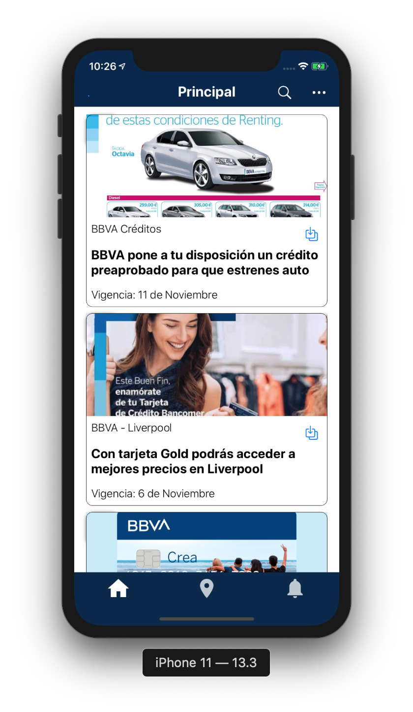
  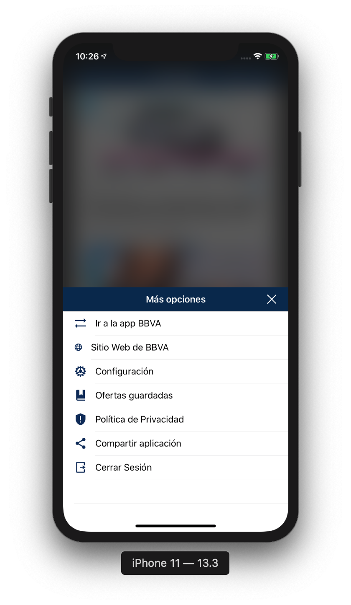
  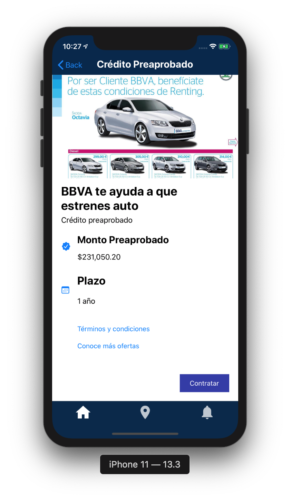
  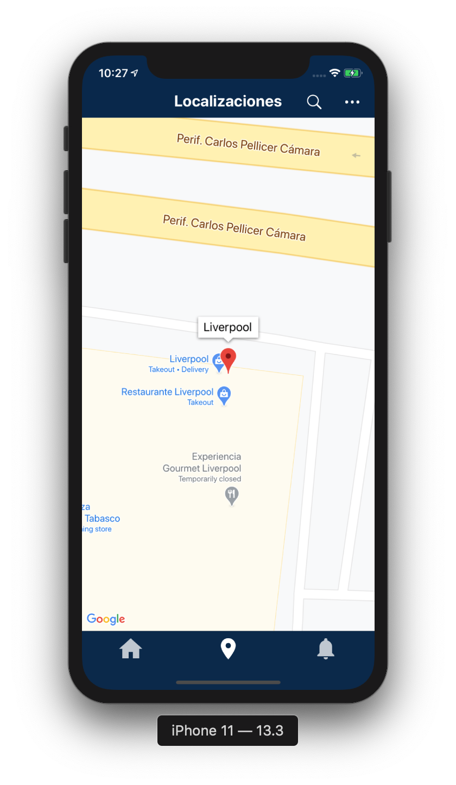
  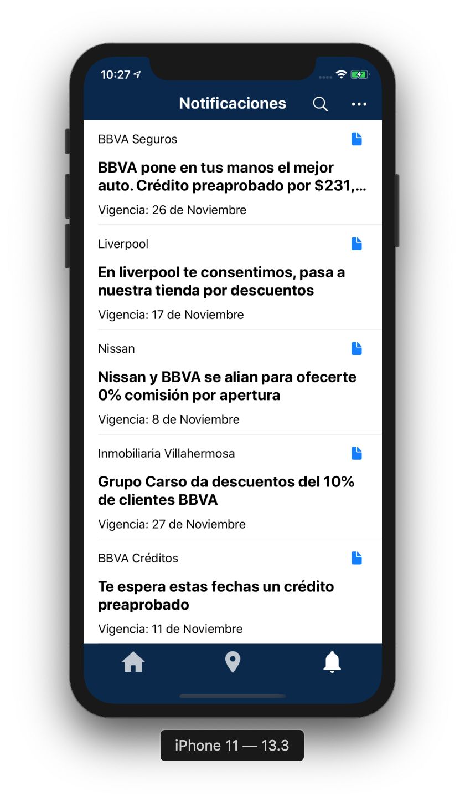

### Android

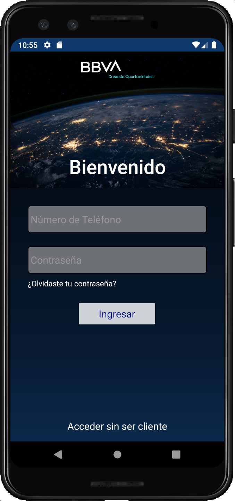
  
  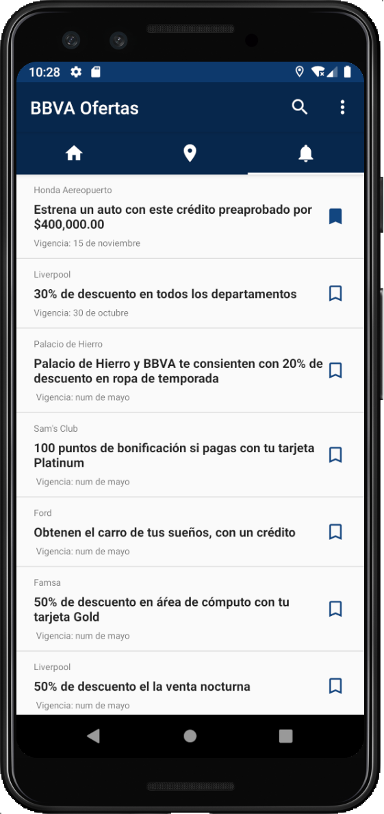
  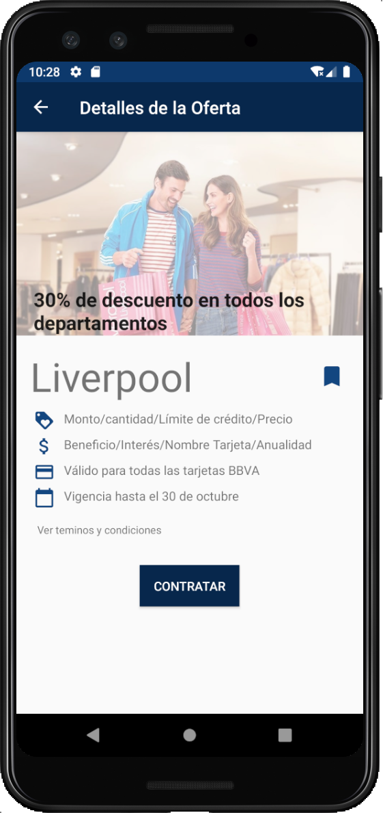
  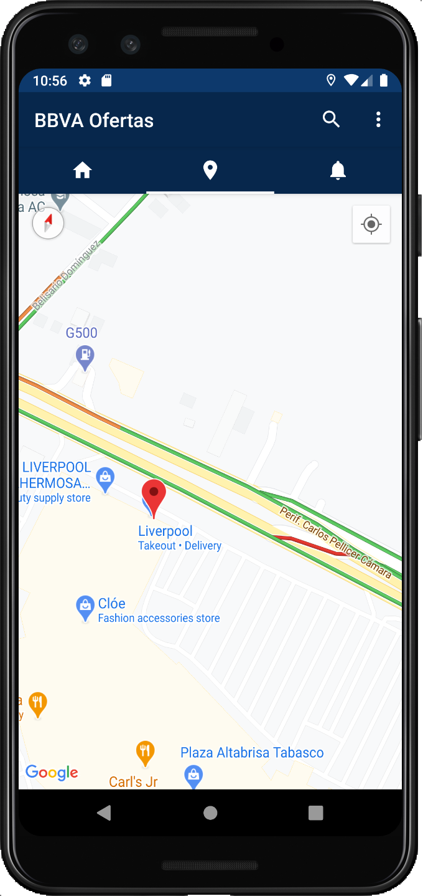
  
  
  

